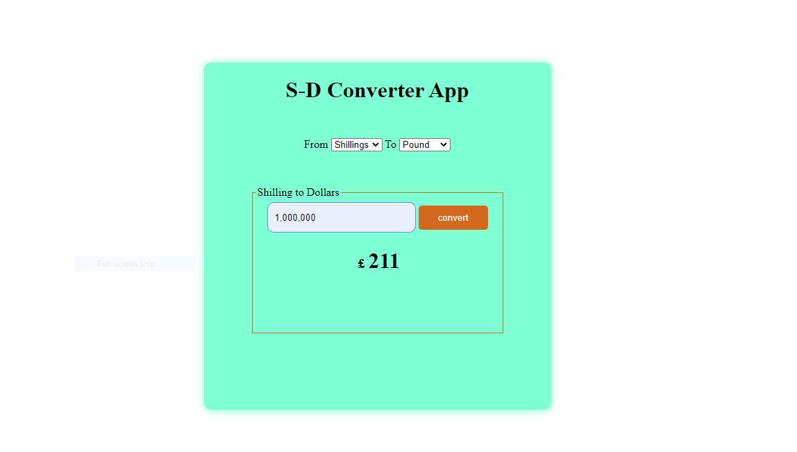

# Currency Converter App

This is a solution to the session assignment that was given at the ablestate creatives limited. It has helped me to improve my coding skills by building a realistic projects. 

## Table of contents

- [Overview](#overview)
  - [The assignment](#the-assignment)
  - [Screenshot](#screenshot)
  - [Links](#links)
- [My process](#my-process)
  - [Built with](#built-with)
  - [What I learned](#what-i-learned)
  - [Continued development](#continued-development)
  - [Useful resources](#useful-resources)
- [Author](#author)
- [Acknowledgments](#acknowledgments)

## Overview

### The Assignment

I was given an assignment to design a simple currency converter application. It has really helped me through understanding the DOM events and how to use javascript to make the website dynamic.
### Screenshot

 

### Links

- [Github URL](https://github.com/wasswaenockmale/javascript-sessions/tree/main/Projects/shillingsToDollar)
- [Live site](https://shilling-to-dollars-application-git-main-wasswaenockmale.vercel.app/)

## The process
### Built with

- HTML5 markup
- CSS properties
- Flexbox
- Javascript

### What I learned

I have learned how to work with the Document Object Model (DOM) events to make the webpage dynamic. 

### Continued development
I want to greatly focus on events handling in order to be able to make my website more dynamic, and I am also looking forward to sharpen my Javascript skills. For the nice designs, I want to focus greatly on advance CSS properties.

### Useful resources

- [Javascript.Info](https://javascript.info/events-change-input)- This website helped me alot in understanding the different betweent 'onchange' and 'oninput' events as used in input parameters.

## Author

- Github - [@wasswaenockmale](https://github.com/wasswaenockmale)
- Twitter - [@wasswaenockmale](https://twitter.com/wasswaenockmale)

## Acknowledgments

I want to thank my instructors at The Ablestate Creatives Limited for the great work they are doing in giving out knowledge. And all the Ablestate fraternity.